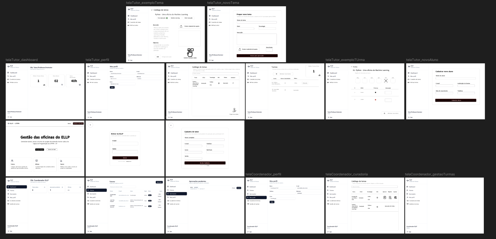

# <h1 align="center"> Certificadora de Competencia Identitaria - ELLP [Gestão de Oficinas] </h1>

 <figure>
  
  <figcaption>Protótipo do website feito com o Figma</figcaption>
 </figure>

# Integrantes do grupo:  

<markdown-accessiblity-table data-catalyst=""><table tabindex="0">
<thead>
  <tr>
    <th align="center"><a href="https://github.com/Luis-Spessoto"> Luís Felipe Spessoto</a></th>
    <th align="center"><a href="https://github.com/BrunoBiazon"> Bruno Circhia Biazon</a></th>
    <th align="center"><a href="https://github.com/JoaoVFB"> João Vitor Furquim</a></th>
   <th align="center"><a href="https://github.com/DaniloFrazon"> Danilo Augusto </a></th>
   <th align="center"><a href="https://github.com/Pedro-Meloo"> Pedro Henrique</a></th>
  </tr>
</thead>
</table></markdown-accessiblity-table>

# Descrição do projeto

  O sistema para gestão de oficinas do ELLP é uma plataforma Fullstack desenvolvida para centralizar e automatizar a gestão das oficinas do projeto de extensão ELLP (Ensino Lúdico de Programação) da UTFPR-CP. O sistema substitui controles manuais, permitindo a gestão de tutores, alunos, turmas e curadoria de oficinas pedagógicas.
  
# Tecnologias

# Divisão Laboral 

- Luís: Responsável pela Prototipagem, UI e Scrum Master
- João: Responsável pelo Módulo de Professores e Tutores
- Danilo: Responsável pelo Módulo de Temas e Curadoria de Oficinas
- Pedro: Responsável pelo Módulo de Alunos e Enturmação
- Bruno: Responsável pelo Banco de Dados e Conectividade/Integração
  
# Link de Acesso
  
